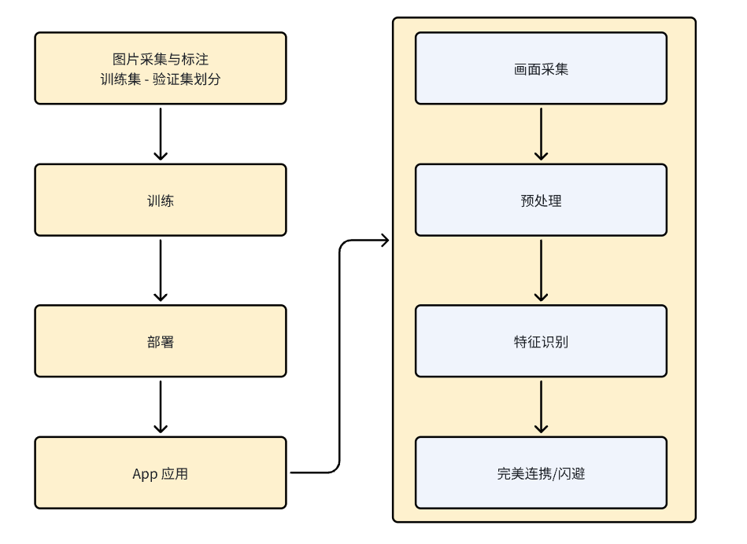

# 项目简介

7月4号体验了一下绝区零，美术和角色很棒，但是战斗对于第一次接触3D动作游戏的我来说，有些困难。特别是刚抽到的安比同源异构11号的卡点火刀操作太难了，同时需要分散注意力进行完美闪避和协同，没有这个实力。于是我突发奇想，制作一个显眼的橙色或红色闪光识别系统，来自动触发闪避操作。

- 橙色闪光表示可以触发完美协同。
- 红色闪光表示协同点数不足，可以触发完美闪避。

项目的初衷纯属娱乐，尝试从数据集制作到训练部署的全流程，顺便尝试科技辅助的游戏体验。这是一个纯辅助工具，拒绝外挂，不会提供“小白使用教程”，非手残禁止使用。

项目演示视频可以查看：[演示视频](https://cloud.tsinghua.edu.cn/f/f290545b6657416bb028/)



# 使用方法

首先将项目克隆到本地：

```bash
git clone https://github.com/yiyangc18/Zzz_PerfectAssist.git
```

然后需要自行下载模型：[模型下载链接](https://cloud.tsinghua.edu.cn/d/cf22fe5b90ba498cbab5/)
把模型文件夹保存在项目目录即可。

```bash
├── Zzz_PerfectAssist
│   ├── model
```

## 安装环境

经过尝试，在一个未安装Python的Windows环境下，安装以下依赖即可正常运行检测脚本：

```bash
pip install -r requirements.txt
```

## 运行

当前模型尚不完美，实机验证中在一些画面复杂的场景容易误判，例如11号搓火刀时容易误判为红光闪光。最简单的解决方案是调整`config.py`中的`SAME_PREDICTION_THRESHOLD`参数，即连续多少帧都判断为红光/橙光就触发动作。根据之前的K帧，在30帧的视频中一次闪光提示会有7帧的画面，所以脚本帧率30时，设置`THRESHOLD`为3~5效果较好。

建议使用有GPU的电脑运行，并确保安装CUDA以及当前版本CUDA支持的PyTorch版本。当前训练好的模型不算大，一般有CUDA的PC能轻易跑到30FPS：

```bash
python realTimeVideoDetect_Cuda.py
```

如果使用CPU运行，而且cpu跑Zzz负担就蛮大的了，不过可以通过视频检测来验证：

```bash
python realTimeVideoDetect.py
```


## 训练

对于有模型训练经验且有兴趣的朋友，可以在已有的数据集上进行训练。目前尝试的模型包括CNN、ResNet、Conformer，在我的数据集上Conformer表现最好，验证集mPA能达到96%，已经足够使用。

Conformer项目地址：[Conformer GitHub](https://github.com/pengzhiliang/Conformer)

分享我的数据集：[数据集下载链接](https://cloud.tsinghua.edu.cn/d/6c1e861238ce4118a2f3/)

就这个项目的经验，改进模型最好的方法是丰富数据集。目前模型尚不完美，实机验证中在一些画面复杂的场景容易误判，这可以通过补充数据集解决。分类数据集制作很简单，只需视频截图并保存到对应目录，无需标注，所以欢迎补充数据集。

## 工程目录

下载数据集和模型后，工程目录结构如下：

```bash
chery@chery-ubuntu20:~/code/Zzz_PerfectAssist$ tree -L 2
.
├── config.py
├── ConformerClassfier.py
├── data
│   ├── dataset_yolo
│   └── sorted_images
├── dataloader.py
├── model
│   ├── best_model_09474_conformer.pth
│   ├── best_model_0964.pth
│   ├── best_model_9474.onnx
│   ├── best_model_9474_unflatten.pth
│   └── best_mpa50_model_09474_conformer.pth
├── model.py
├── deploy
│   ├── build
│   ├── CMakeLists.txt
│   ├── torch2onxx.py
│   ├── onnx_deploy_test.cpp
│   ├── onnxruntime-linux-x64-gpu-1.18.1
│   ├── deploy_validation_onnx.py
│   └── deploy_validation.py
├── prediction_log.txt
├── preprocess.py
├── training_log.txt
├── train.py
└── train_yolo.ipynb
```

`config.py`：训练参数

`model.py`：模型定义

`train.py`：训练脚本（有一个参数指定模型）

`preprocess.py`：预处理

# 后续计划


- [ ] 模型部署优化，争取在CPU上达到30FPS。
- [ ] 增加音频特征识别：
  - [ ] 音频谱分析辅助判断。
  - [ ] 多头注意力机制+音频画面多模态输入。
- [ ] 视频加时间戳label的特征检测。


# 项目成员

首先感谢我自己[chery](https://github.com/yiyangc18)和米哈游。能在工作之余抽空玩绝区零，有了这个有趣的想法并在一周内基本实现。

感谢[chyy](https://github.com/chyy09)为本项目模型训练提供的指导，包括数据集困难负样本、数据集平衡以及缓解训练过拟合的方法。

感谢[chenovopride](https://github.com/chenovopride/chenovopride)为本项目模型部署、推理加速提供的技术指导，包括静态优化方法、量化与推理框架。

感谢以下数据集来源：
- [企鹅带带北极熊录播](https://www.bilibili.com/video/BV1by411i7mC)
- [【绝区零】3步掌握基础操作](https://www.bilibili.com/video/BV1Si421e7mk)
- [11号的正确玩法！](https://www.bilibili.com/video/BV1yz421q738)
- [绝区零首个4K无UI高燃BOSS战！](https://www.bilibili.com/video/BV1tw411n7pt)
- [4K三测困难模式全BOSS无伤演示！](https://www.bilibili.com/video/BV1UH4y1V7mT)

---

希望这版README对你有帮助。如果需要进一步修改或添加内容，请随时告知。